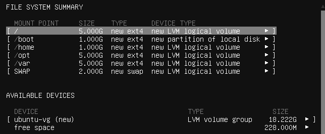
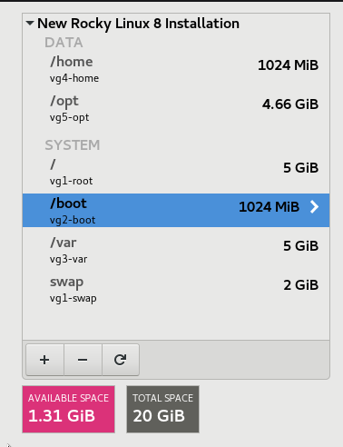
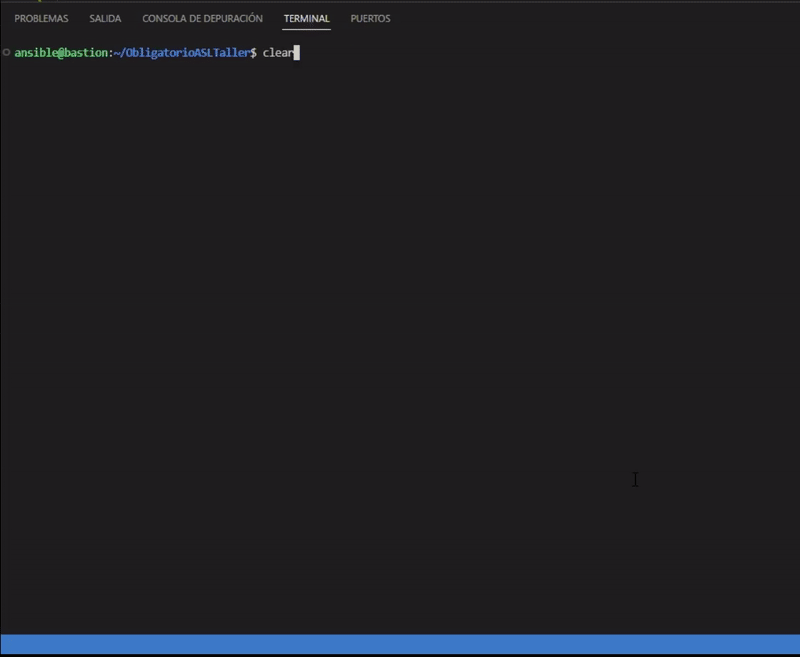
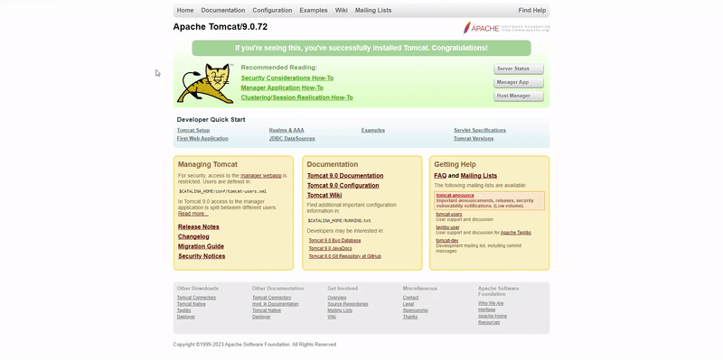

<p align="center">
  
  
  
</p>

# **Obligatorio ASLTaller**

## Requisitos

  - Automatizar la instalacion de un servidor SQL y otro servidor Tomcat 9 en una distribucion Linux Debian y Redhat
  - El servidor SQL puede ser mariadb o MySQL y debe automatizarse la creacion de las bases de datos y las tablas
  - El servidor Tomcat 9 debe instalarse en la ubicacion "/opt", ejecutarse con el usuario y grupo "tomcat" e iniciarse mediante un servicio
  - Se debe contar con un servidor "Bastion" desde donde se ejecuten las automatizaciones
  - Ambos servidores deben estar "hardenizados" y conectarse mediante una red interna
  - Los servidores Linux deben tener el siguiente esquema de particion:      
      - 1 particion de 1GB para **/boot**
      - Usando LVM: un volumen lógico de 5GB para **/**, 5GB para **/var**, 1GB para **/home**, 5GB **/opt** y 2GB de **Swap**
  - Se debe crear un usuario que sea "sudoer" y permita la ejecucion de comandos sin contraseña

## Preparacion de entorno

### **Servidor Bastion:**

* Configuracion de Red NAT
    ```yaml 
    2: enp0s3: <BROADCAST,MULTICAST,UP,LOWER_UP> mtu 1500 qdisc fq_codel state UP group default qlen 1000
        link/ether 08:00:27:37:bc:d1 brd ff:ff:ff:ff:ff:ff
        inet 10.0.2.15/24 metric 100 brd 10.0.2.255 scope global dynamic enp0s3
        valid_lft 64943sec preferred_lft 64943sec
        inet6 fe80::a00:27ff:fe37:bcd1/64 scope link 
        valid_lft forever preferred_lft forever

    ```

* Configuracion de Red interna
    ```yaml
    3: enp0s8: <BROADCAST,MULTICAST,UP,LOWER_UP> mtu 1500 qdisc fq_codel state UP group default qlen 1000
        link/ether 08:00:27:19:75:94 brd ff:ff:ff:ff:ff:ff
        inet 192.168.200.1/24 brd 192.168.200.255 scope global enp0s8
        valid_lft forever preferred_lft forever
        inet6 fe80::a00:27ff:fe19:7594/64 scope link 
        valid_lft forever preferred_lft forever
    ```

* Creacion de usuario Ansible en bastion

    `root@bastion~ # useradd ansible -m -s /bin/bash`

* Adicion de usuario Ansible a  grupo "sudoers"

    `root@bastion~ # usermod -aG sudo ansible`

* Instalacion de Git y Ansible

    `ansible@bastion~ $ sudo dnf install git ansible`


* Generar par de claves SSH en bastion

    `ansible@bastion~ $ ssh-keygen`

### **Servidores Ubuntu y Rocky:**

* Esquema de particion de Ubuntu

    

* Esquema de particion de Rocky

    


* Creacion de usuario Ansible en Rocky y Ubuntu
   
    `root@localhost~ # useradd ansible -m -s /bin/bash`

* Adicion de usuario Ansible a grupo "sudoers" en Ubuntu y Rocky
    
    `root@localhost~ # usermod -aG sudo ansible` - *Ubuntu*

    `root@localhost~ # usermod -aG wheel ansible` - *Rocky*

* Permitir a Ansible ejecutar comandos sin contraseña en Ubuntu y Rocky

    `ansible@localhost~ $ sudo visudo`

    ```js
    ansible     ALL=(ALL)   NOPASSWD:ALL
    ```

* Configuracion de Red interna para Ubuntu

    `ansible@localhost~ $ sudo nano /etc/netplan/00-installer-config.yaml`

    ```yaml
    network:
      ethernets:
        enp3s0:
          dhcp4: true
        eno0s8:
          addresses:
          - 192.168.200.2/24
          nameserver:
            addreses:
            search:
      version: 2
    ```

* Configuracion de Red interna para Rocky

    `ansible@localhost~ $ nmtui `

    ```js
    cat /etc/sysconfig/network-scripts/enp0s8

    TYPE=Ethernet
    PROXY_METHOD=none
    BROWSER_ONLY=no
    BOOTPROTO=none
    DEFROUTE=yes
    IPV4_FAILURE_FATAL=no
    IPV6INIT=yes
    IPV6_AUTOCONF=yes
    IPV6_DEFROUTE=yes
    IPV6_FAILURE_FATAL=no
    IPV6_ADDR_GEN_MODE=eui64
    NAME=enp0s8
    UUID=1ad15859-7d48-498d-8984-d57bcc927256
    DEVICE=enp0s8
    ONBOOT=yes
    IPADDR=192.168.200.3
    PREFIX=24
    ```

* Distribucion de par de llaves SSH previamente creadas en Bastion

    `ansible@bastion~ $ ssh-copy-id ansible@192.168.200.2` - *Ubuntu*

    `ansible@bastion~ $ ssh-copy-id ansible@192.168.200.3` - *Rocky*

### **Configuracion de Ansible:**

* Instalacion de colecciones de hardening en Bastion

    `ansible@bastion~ $ ansible-galaxy collection install devsec.hardening`

## **Detalles del playbook "site.yml"**

* Instalacion de podman a traves del modulo "package" en todos los servidores

```yaml
- name: Install podman
  hosts: all
  become: yes
  tasks:
    - name:
      package:
        name: podman
        state: latest
```
* Instalacion del servidor SQL  utilizando el rol "[ansible-mariadb](https://github.com/SalvadorOlivar/ObligatorioASLTaller/tree/main/roles/ansible-mariadb)" utilizando las variables encriptadas en "docker-maridb.yml"

```yaml
- name: Install and configure db servers
  hosts: all
  vars_files:
    - ./group_vars/docker-mariadb.yml
  roles:
    - role: ansible-mariadb
      become: yes
```


## **Ejecucion de playbook de Ansible:**


`ansible@bastion~ $ ansible-playbook --ask-vault-password site.yml -i hosts.ini`





* Tomcat y base de datos funcionando


